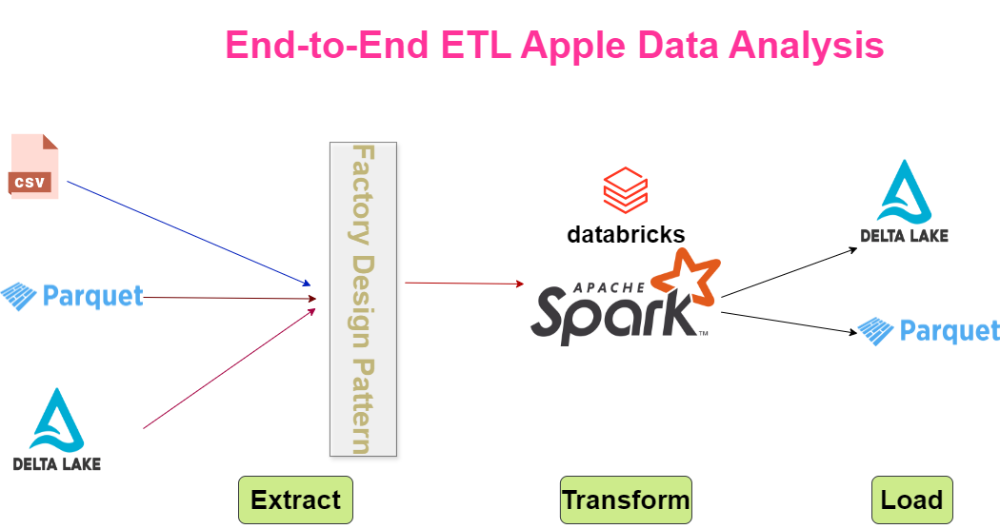

# Apple Customer Purchase Analysis — PySpark ETL Pipeline

A scalable end-to-end ETL pipeline built with **PySpark** on **Databricks**, designed to analyze Apple customer purchasing behavior and extract valuable business insights.

---

## 🚀 Technologies Used
- **PySpark** – for distributed data processing  
- **Databricks** – for notebook orchestration and collaborative development  
- **Delta Lake** – for reliable, scalable data storage  
- **ETL Pipeline Design** – modular and extensible architecture  
- **Factory Method Design Pattern** – to promote clean code and loose coupling in reader/loader creation  

---

## 🧱 Architecture Diagram

---

## 🔄 ETL Pipeline

### 🔍 Extract
- Data sourced from **CSV**, **Parquet**, and **Data Lake** formats.
- Dynamic reader instantiation via the **Factory Method Pattern** to support multiple input types seamlessly.

### 🧪 Transform
Performed data cleaning and complex business logic using PySpark DataFrame API.  
Implemented business-driven use cases:
- Identify customers who purchased **both iPhone and AirPods**
- Identify customers who purchased **only iPhone and AirPods** and **nothing else**
- List **products bought after the first purchase**
- Calculate the **average time delay** between iPhone and AirPod purchases
- Find the **top 3 selling products per category**

### 📦 Load
- Output datasets written to **Delta Lake tables** and **Parquet files**.
- Data ready for downstream BI reporting or ML use cases.

---

## ✅ Key Learnings
This project solidified advanced concepts in big data engineering:
- Efficient use of **PySpark DataFrame APIs**
- Best practices in **ETL modularization**
- Optimized data transformations with **bucketing**, **partitioning**, and **broadcast joins**
- Clean architecture using **design patterns** for maintainability and extensibility

---

## 📁 Project Structure
- apple_data_analysis.py # Main pipeline runner
- extractor.py # Handles data extraction logic
- reader_factory.py # Factory for creating data readers
- transform.py # Business transformations and analysis
- loader.py # Handles data writing logic
- loader_factory.py # Factory for creating data loaders
- architecture_diagram.png # Visual architecture of the ETL pipeline

